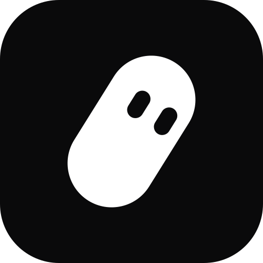
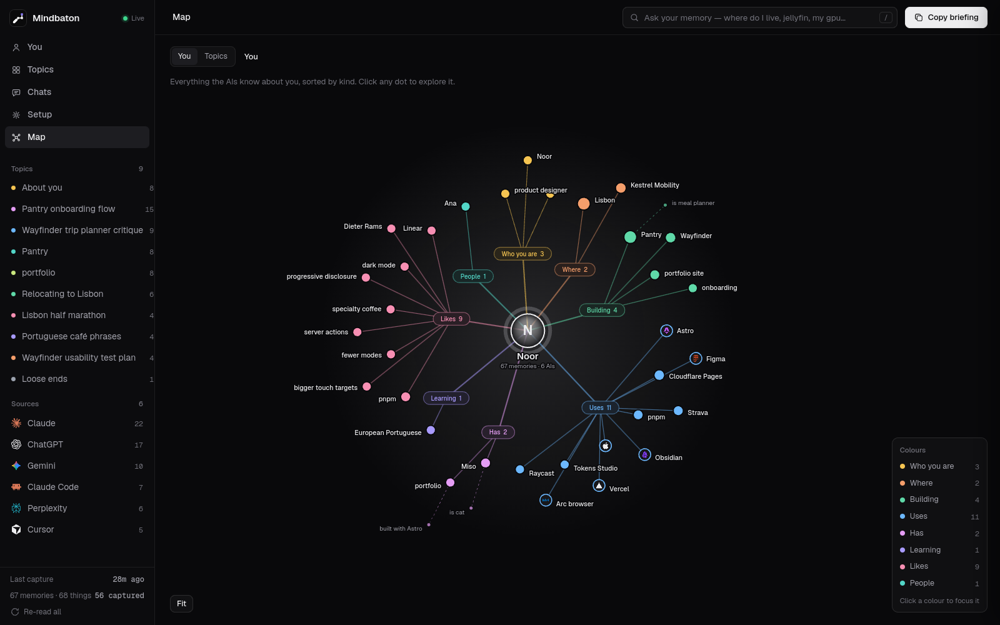
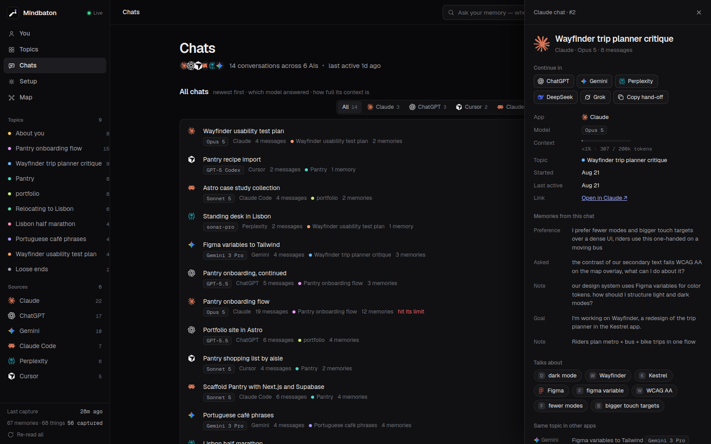
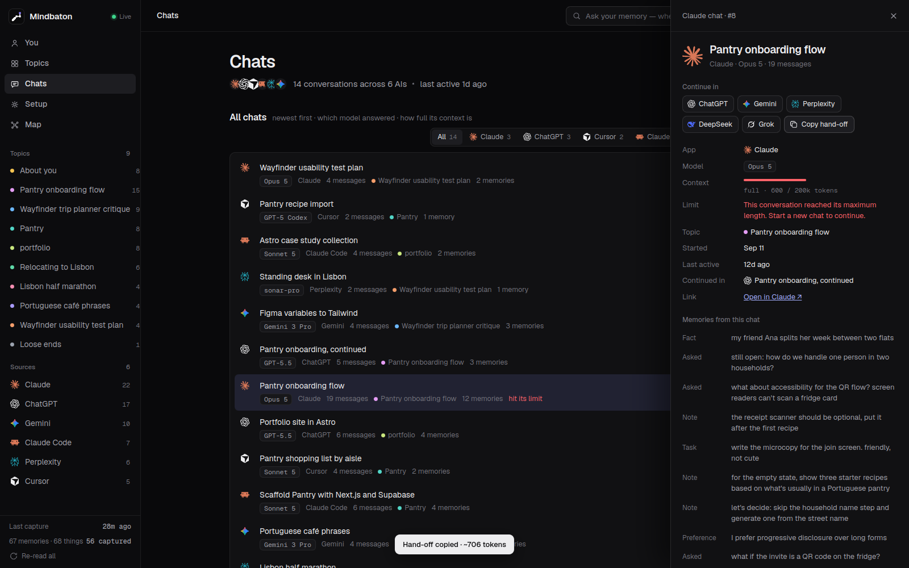
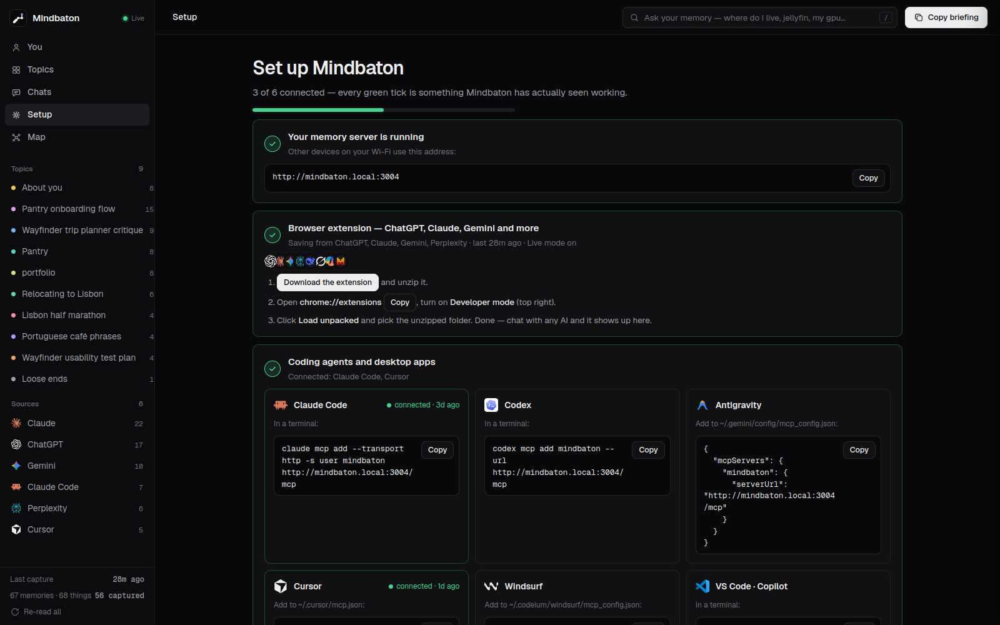

<p align="center">
  
</p>

<h1 align="center">Mindbaton</h1>

<p align="center">
  <b>Tell one AI. Every AI knows.</b><br>
  One private memory for ChatGPT, Claude, Gemini, Claude Code, Cursor and every other AI you use — running on your own computer.
</p>

<p align="center">
  <a href="#quick-start">Quick start</a> ·
  <a href="docs/connect.md">Connect your AIs</a> ·
  <a href="docs/getting-started.md">Docs</a> ·
  <a href="https://dkshbyte.github.io/mindbaton/">Website</a>
</p>



## What is it?

You talk to lots of AIs. Each one forgets you the moment you open another app.

Mindbaton fixes that:

1. **It listens.** A browser extension saves what you tell ChatGPT, Claude, Gemini and friends. Coding agents like
   Claude Code, Codex and Cursor save to it directly.
2. **It remembers.** Everything lands in one memory on *your* box — who you are, what you're building, what you like —
   sorted into topics by itself.
3. **Every AI can ask it.** Any AI can look up what you've told the others.
4. **Pass the baton.** When a chat gets too long, Mindbaton packs it up so a different AI can pick it up and keep going.

No cloud, no account, no subscription. It's a small Python program and one database file.

## Features

- **Works with the AIs you already use** — ChatGPT, Claude, Gemini, Perplexity, DeepSeek, Grok, Copilot, Poe, Mistral
  and Google AI Studio in the browser; Claude Code, Codex, Cursor, Windsurf, VS Code, Gemini CLI, Antigravity, Cline,
  Zed, OpenCode and Claude Desktop over MCP; the Claude and ChatGPT apps as a custom connector.
- **Whole chats, not just snippets** — which AI and which model answered, and how full the chat's context window is.
- **Hand-offs** — one click turns a chat into a hand-off pack another AI continues from.
- **Topics that make sense** — the same subject talked about in two apps becomes one topic.
- **Ask it anything** — "where do I live?", "what GPU do I have?" get a direct answer, with the memories behind it.
- **Forget in one click** — and it stays forgotten, even after a rebuild.
- **Secrets stay out** — API keys and passwords you paste into a chat are blanked out before anything is saved.
- **Works offline** — understanding is plain rules, no AI needed. Add a free Gemini or Groq key if you'd like nicer
  hand-off summaries and topic names.
- **Phone app** — install it on your phone; on Android, share things into it from any app.
- **Bring your old memory** — paste what ChatGPT, Claude, Gemini and others remember about you (one ready-made prompt),
  check every fact, import. Coding agents' memory files (Claude Code, Codex, Gemini CLI, OpenCode…) come in when you connect them.
- **Everyone gets their own memory** — add the people you live with; each account is private and separate.
- **Install it where it lives** — the installer sets it up on this computer, gives you the command for your server, or
  finds a Mindbaton already running on your network and links to it.
- **Yours to take** — export everything as JSON, Neo4j Cypher or GraphML.

<table>
  <tr>
    <td></td>
    <td></td>
  </tr>
  <tr>
    <td></td>
    <td></td>
  </tr>
</table>

## Quick start

You need a computer that stays on (a home server, a NAS, a Mac mini, a Raspberry Pi 4 or your laptop) with
**Python 3.9+** or **Docker**.

**Linux or macOS**

```sh
git clone https://github.com/DkshByte/mindbaton && cd mindbaton && ./install.sh
```

The installer checks Python, runs a self-test, starts Mindbaton as a background service and prints a link like
`http://192.168.1.20:3004/?code=4821-7730`. Open it and choose your password. That's it.

**Docker** (also Windows and NAS boxes)

```sh
git clone https://github.com/DkshByte/mindbaton && cd mindbaton && docker compose up -d
docker compose logs mindbaton | grep "Setup code"
```

Open `http://<this computer>:3004/?code=<the code>` and choose your password.

Then open the **Setup** page: it shows a green tick for everything connected and the exact copy-paste step for
everything that isn't. More detail, Windows, and what the setup code is for: [docs/getting-started.md](docs/getting-started.md).

## Connect your AIs

| You use | How it connects | Guide |
|---|---|---|
| ChatGPT, Claude, Gemini, Perplexity, DeepSeek, Grok, Copilot, Poe, Mistral (in the browser) | Browser extension — press `Alt+M` in any chat to bring your memory in. It connects to your Mindbaton with a pairing code | [Extension](docs/connect.md#browser-extension) |
| Claude Code, Codex, Cursor, Windsurf, VS Code, Gemini CLI, Antigravity, OpenCode | MCP over HTTP, with a device token | [Coding agents](docs/connect.md#coding-agents-and-editors) |
| Claude Desktop | MCP through the small `mcp_stdio.py` bridge | [Claude Desktop](docs/connect.md#claude-desktop) |
| Claude and ChatGPT apps (web and phone) | Custom connector — needs an HTTPS address | [Connectors](docs/connect.md#claude-and-chatgpt-apps) |
| Your phone | Install Mindbaton as an app, then share into it | [Phone](docs/connect.md#phone) |

Each device gets its own token, which you can see and revoke any time under **Settings → Devices**.

## Your data stays yours

- Mindbaton runs on your hardware and keeps everything in one SQLite file in `data/`. Nothing is sent anywhere —
  no telemetry, no account, no cloud.
- The only time it talks to the internet is if **you** add a free AI key: then the text needed for a hand-off summary,
  a topic name or a search answer goes to that provider (Gemini or Groq). Leave the key out and it never does.
- Everything is behind your password, and every app or device uses its own revocable token.
- Want to reach it away from home? Use HTTPS (Tailscale or Cloudflare Tunnel) — never open the port on your router.
  See [docs/remote-access.md](docs/remote-access.md).

## Docs

- [Getting started](docs/getting-started.md) — install on Linux, macOS, Windows, Docker or a NAS; first run; forgotten password
- [Connect your AIs](docs/connect.md) — extension, coding agents, Claude Desktop, Claude/ChatGPT apps, phone
- [Remote access](docs/remote-access.md) — Tailscale, Cloudflare Tunnel, a reverse proxy
- [Configuration](docs/configuration.md) — every setting
- [Backup and upgrade](docs/backup-and-upgrade.md)
- [Troubleshooting](docs/troubleshooting.md)
- [Security](SECURITY.md) · [Contributing](CONTRIBUTING.md)

## License

Mindbaton is free software under the [GNU Affero General Public License v3.0](LICENSE) (AGPL-3.0). You can use,
change and share it; if you run a changed version for other people over a network, you must offer them its source too.

ChatGPT, Claude, Gemini and other product names and logos are trademarks of their owners. Mindbaton is an independent
project, not affiliated with or endorsed by them. [Privacy](https://dkshbyte.github.io/mindbaton/privacy.html) ·
[Terms](https://dkshbyte.github.io/mindbaton/terms.html)
